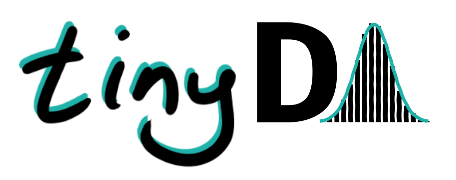
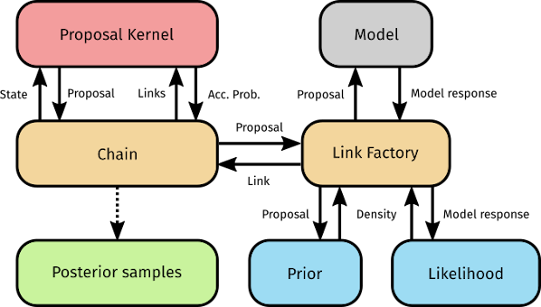

# tinyDA
Delayed Acceptance (Christen & Fox, 2005) MCMC sampler with finite-length subchain sampling and adaptive error modelling. 

This is intended as a simple, lightweight implementation, with minimal dependencies, i.e. nothing beyond the SciPy stack. 

It is fully imperative and easy to use!

### This is still a work in progress.

## Features

### Proposals
* Random Walk Metropolis Hastings (RWMH) - Metropolis et al. (1953), Hastings (1970)
* preconditioned Crank-Nicolson (pCN) - Cotter et al. (2013)
* Adaptive Metropolis (AM) - Haario et al. (2001)
* Adaptive pCN - Hu and Yao (2016)
* DREAM(Z) - Vrugt (2016)
* Transport Map MCMC - Parno and Marzouk (2017)
* Multiple-Try Metropolis (MTM) - Liu et al. (2000)

### Adaptive Error Models
* State independent - Cui et al. (2018)
* State dependent - Cui et al. (2018)

### Diagnostics
* A bunch of plotting functions
* Rank-normalised split-  and ESS - Vehtari et al. (2020)

### Dependencies:
* NumPy
* SciPy
* tqdm
* [pyDOE](https://pythonhosted.org/pyDOE/) (optional)
* [TransportMaps](http://transportmaps.mit.edu/docs/) (optional)

## Usage
A few illustrative examples are available as Jupyter Notebooks in the root directory. Below is a short summary of the core features.

### Distributions
The prior and likelihood can be defined using standard `scipy.stats` classes:
```python
import tinyDA as tda

from scipy.stats import multivariate_normal

mean_prior = np.zeros(n_dim)
cov_prior = np.eye(n_dim)
cov_likelihood = sigma**2*np.eye(data.shape[0])

my_prior = multivariate_normal(mean_prior, cov_prior)
my_loglike = tda.LogLike(data, cov_likelihood)
```
If using a Gaussian likelihood, we recommend using the `tinyDA` implementation, since it is unnormalised and plays along well with `tda.AdaptiveLogLike` used for the Adaptive Error Model. Home-brew distributions can easily be defined, and must have a `.rvs()` method for drawing random samples and a `logpdf(x)` method for computing the log-likelihood, as per the `SciPy` implementation.

### tinyDA.LinkFactory
The sampler is constructed around what we call a `LinkFactory`, which is responsible for:
1. Evaluating the model and collecting the model output.
2. Evaluating the posterior density, given the parameters.
3. Constructing `tda.Link` instances that hold information for each sample.



The `LinkFactory` must be defined by inheritance from either `tda.LinkFactory` or `tda.BlackBoxLinkFactory`. The former allows for computing the model output directly from the input parameters, using pure Python or whichever external library you want to call. The `evaluate_model()` method must thus be overwritten:

```python
class MyLinkFactory(tda.LinkFactory):
    def evaluate_model(self, parameters):
        output = parameters[0] + parameters[1]*x
        qoi = None
        return output, qoi

my_link_factory = MyLinkFactory(my_prior, my_loglike)
```

The latter allows for feeding some model object and some datapoints to the `LinkFactory` at initialisation, which are then assigned as class attributes. This is useful for e.g. PDE solvers. The `evaluate_model()` method must be overwritten.
```python
class MyLinkFactory(tda.BlackBoxLinkFactory):
    def evaluate_model(self, parameters):
        self.model.solve(parameters)
        output = self.model.get_data(self.datapoints)
        if self.get_qoi:
            qoi = self.model.get_qoi()
        else:
            qoi = None
        return output, qoi

my_link_factory = MyLinkFactory(my_model, my_datapoints, my_prior, my_loglike, get_qoi=True)
```
### Proposals
A proposal is simply initialised with its parameters:
```python
am_cov = np.eye(n_dim)
am_t0 = 1000
am_sd = 1
am_epsilon = 1e-6
my_proposal = tda.AdaptiveMetropolis(C0=am_cov, t0=am_t0, sd=am_sd, epsilon=am_epsilon)
```

### Sampling
The Delayed Acceptance sampler can then be initalised and run, simply with:
```
my_chain = tda.DAChain(my_link_factory_coarse, my_link_factory_fine, my_proposal, subsampling_rate)
my_chain.sample(n_samples)
```
If you decide you need more samples, you can just call `tda.DAChain.sample()` again, since all samples and tuning parameters are cached:
```
my_chain.sample(additional_n_samples)
```

### Postprocessing
The entire sampling history is then stored in `my_chain.chain_fine`, and you can extract an array of parameters by doing something like:
```python
parameters = np.array([link.parameters for link in my_chain.chain_fine])
```
Some diagnostics are available in the diagnostics module. Please refer to their respective docstrings for usage instructions.

# TODO
* More user-friendly diagnostics
* Parallel multi-chain sampling
* Population-based proposals
